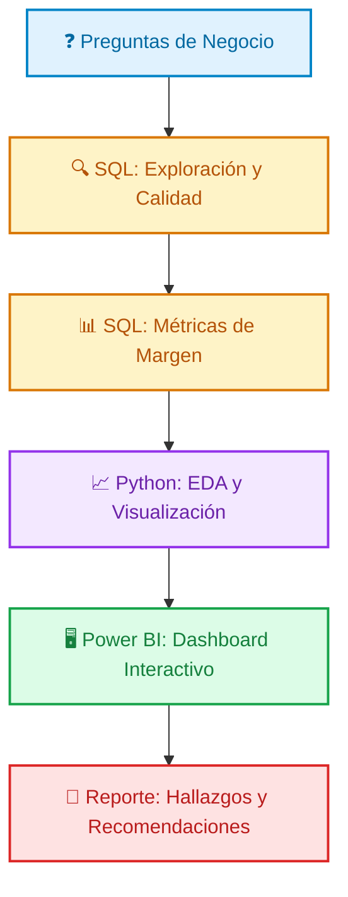

<div align="center">
 
  📌 Este documento complementa el [README.md](https://github.com/yabreu-data/optimizacion_margen_item/blob/main/README.md) del proyecto.
</div>

<br>

> ### 🎯 Objetivo Principal
> Detallar el contexto de negocio, preguntas, hipótesis y alcance del análisis de optimización de margen de ganancia para **i-tem**.
---

### Índice
[Escenario](#-escenario-de-negocio-i-tem) &emsp;|&emsp; [Problema](#%EF%B8%8F-el-problema-crítico) &emsp;|&emsp; [Análisis](#-problema-analítico) &emsp;|&emsp; [Stakeholders](#-stakeholders) &emsp;|&emsp; [Objetivos](#-objetivos-del-proyecto) &emsp;|&emsp; [Hipótesis](#-hipótesis-iniciales) &emsp;|&emsp; [Alcance](#-alcance-del-proyecto) &emsp;|&emsp; [Resultados](#-resultados-esperados)


<br><br><br><br><br><br><br><br><br><br><br><br><br><br><br><br>

## 🏢 Escenario de Negocio: i-tem

> **i-tem** es una cadena de retail de electrónicos y accesorios en Chile que opera en un mercado competitivo a través de **4 sucursales estratégicas**: Norte, Sur, Este y Oeste.

<br>

### ⚠️ El Problema Crítico

i-tem opera sin visibilidad clara sobre su rentabilidad real: no sabe cómo se relaciona el `precio_venta` con el `costo_unitario` por producto, cuánto gana cada sucursal en términos netos, ni cómo varía el margen a lo largo del año. Esta falta de visibilidad bloquea decisiones clave de negocio: qué productos priorizar en promociones, cómo asignar inventario y personal entre sucursales, y cuándo ajustar precios o costos para maximizar la utilidad.

> [!WARNING]
> ### Impacto de NO resolver el problema
> * **Estrategias ciegas:** Promoción activa de productos con **alto volumen de ventas pero bajo margen de ganancia.**
> * **Inversión ineficiente:** Distribución incorrecta de recursos de inventario y personal hacia sucursales **poco rentables.**
> * **Pérdida de ventaja competitiva:** Incapacidad operativa para ajustar precios y compras de forma dinámica para **maximizar la utilidad.**


<br>

### — Solución Analítica Requerida
El equipo directivo de *i-tem* requiere una solución analítica que permita alcanzar cuatro objetivos clave:

| Pilar | Objetivo Estratégico |
| :--- | :--- |
| 💰 **Rentabilidad** | Identificar productos con mayor margen de ganancia (no solo los más vendidos). |
| 🏬 **Benchmark** | Comparar de forma directa el desempeño financiero entre sucursales. |
| 📅 **Temporalidad** | Detectar tendencias estacionales que afecten la rentabilidad a lo largo del año. |
| 🚀 **Acción** | Proponer estrategias concretas para optimizar inventario y ventas. |
---

<br>

## 📊 Problema Analítico

El core de este proyecto consiste en auditar el ecosistema de datos de **ventas, costos, productos y sucursales** cubriendo el ciclo histórico de **Marzo 2024 a Febrero 2025**. 

A continuación, puedes desplegar los ejes analíticos que estructuran las consultas y scripts:

<details>
<summary>📂 <b>Haz clic aquí para ver las Preguntas Clave del análisis</b></summary>

### 1. Rentabilidad por Producto
* ¿Cuáles son los 5 productos líderes en margen unitario (precio_venta - costo_unitario)?
* ¿Qué artículos muestran alto volumen transaccional pero retorno marginal bajo?
* ¿Qué productos tienen costos de adquisición desproporcionados frente a su precio público?

### 2. Desempeño por Sucursal
* ¿Qué sede genera la mayor ganancia neta estructural?
* ¿Cuál sucursal arrastra el peor ratio costos/ventas (fuga de eficiencia operativa)?
* ¿Qué sucursal lidera el margen promedio por transacción individual?

### 3. Tendencias Estacionales
* ¿Qué meses concentran los picos reales de margen de ganancia?
* ¿Cómo fluctúa el margen promedio de los productos estrella según la época del año?

### 4. Síntesis y Recomendaciones (se responde al final, con base en los hallazgos de 1-3)
* ¿Qué 3 productos específicos deben priorizarse en pauta comercial?
* ¿Qué sucursal necesita una reestructuración urgente de costos o precios?

</details>

---

<br>

## 👥 Stakeholders

| Rol | Necesidad Primaria | Uso de los Resultados |
| :--- | :--- | :--- |
| - **Gerentes de Sucursal** | Saber qué productos priorizar en su sucursal para maximizar ganancias. | Uso del dashboard para identificar/aislar los productos de mayor margen en su región. |
| - **Equipo de Compras** | Optimización de inventario basada en rendimiento económico, no solo en demanda. | Ajustar órdenes de compra priorizando alta rotación combinada con alto margen. |
| - **Dirección General** | Contención de costos y escalabilidad del beneficio neto global. | Decisiones estratégicas de gobernanza (redistribución, ajustes de precios o auditoría de sedes). |

---

<br>

## 🎯 Objetivos del Proyecto

### Objetivo General
Desarrollar una **solución integral de análisis de datos** que le permita a **i-tem** descubrir, aislar y explotar oportunidades financieras para maximizar el margen de ganancia mediante la auditoría de productos, rendimiento por sucursal y estacionalidad de costos.

### Objetivos Específicos
* **Calcular y rankear** el margen real por producto mediante la relación de costos y precios.
* **Modelar el benchmark** financiero para contrastar la ganancia neta entre todas las sucursales.
* **Identificar patrones estacionales** mapeando las curvas de ingresos y costos por mes.
* **Detectar ineficiencias de volumen** aislando productos populares pero poco rentables.
* **Formular 3 estrategias de negocio accionables** respaldadas directamente por los datos resultantes.

---

<br>

## ❓ Hipótesis Iniciales

A través de las consultas en SQL y scripts de Python se validará o refutará el siguiente mapa de hipótesis:

| Código | Hipótesis de Negocio | Métrica de Validación |
| :---: | :--- | :--- |
| **H1** | La categoría de **electrónica** aporta un margen superior frente a la categoría de accesorios. | Margen promedio agrupado por categoría de producto. |
| **H2** | La **Sucursal Norte** (Santiago) es la unidad con mayor ganancia neta general. | Ganancia neta totalizada por ID de sucursal. |
| **H3** | Existe una clara estacionalidad con picos económicos en **Diciembre** y **Marzo**. | Sumatoria de ventas indexada por meses cronológicos. |
| **H4** | Los productos con mayor volumen de venta física **no** son los que dejan más dinero a la empresa. | Matriz de dispersión: `cantidad_vendida` vs. `margen_por_unidad`. |
| **H5** | La **Sucursal Oeste** (Antofagasta) sufre el ratio `costos/ventas` más alto debido al impacto logístico. | Operación `SUM(total_costo) / SUM(total_venta)` por sede. |

---

<br>

## 🧪 Alcance del Proyecto

<table border="0">
  <tr>
    <td valign="top" width="50%">
      <h3>✅ Lo que INCLUYE</h3>
      <ul>
        <li><b>Ventana Temporal:</b> Marzo 2024 - Febrero 2025 (12 meses).</li>
        <li><b>Datos bajo auditoría:</b> Tablas <code>sucursales</code>, <code>productos</code>, <code>ventas</code> y <code>costos</code> (~10,000 registros).</li>
        <li><b>KPIs Core:</b> Margen unitario, ganancia neta de sucursal, ratio operativo y curvas estacionales.</li>
        <li><b>Entregables Técnicos:</b> Repositorio documentado, código de procesamiento, Dashboard y reporte ejecutivo.</li>
      </ul>
    </td>
    <td valign="top" width="50%">
      <h3>❌ Lo que NO INCLUYE</h3>
      <ul>
        <li><b>Datos Reales:</b> Los datasets son sintéticos y simulados exclusivamente con fines educativos.</li>
        <li><b>Análisis de Clientes:</b> No se contempla la segmentación demográfica por falta de tablas de clientes.</li>
        <li><b>Modelos Predictivos:</b> El alcance es estrictamente descriptivo e histórico.</li>
        <li><b>Fase de Implementación:</b> El proyecto concluye en la entrega del insight estratégico, no en su ejecución en tiendas.</li>
      </ul>
    </td>
  </tr>
</table>

### 🛠️ Stack Tecnológico Utilizado
<p align="left">
  &nbsp;&nbsp;&nbsp;&nbsp;
  &nbsp;&nbsp;&nbsp;&nbsp;
  
</p>

---

<br>

## ✍🏻 Metodología



---
<br>

## ✅ Resultados Esperados

Al finalizar el procesamiento de datos, el proyecto entregará las siguientes capacidades:

* [x] **Top 5 de Productos Rentables:** Identificación inequívoca de los artículos que empujan el margen para enfocar esfuerzos de marketing.
* [x] **Ranking de Sucursales:** Tabla ordenada de ganancias netas para aplicar planes de contención donde el ratio costos/ventas sea deficiente.
* [x] **Monitoreo Estacional Dinámico:** Visualización clara de los ciclos comerciales anuales dentro de una interfaz de inteligencia de negocios.
* [x] **Estrategias con Casos Reales de Simulación:**
  * *"Priorizar stock de Laptops en Sucursal Norte (Margen detectado: 40%)"*.
  * *"Auditar costos operativos en Sucursal Oeste (Ratio de gasto excedido en 60%)"*.
* [x] **Portafolio Abierto:** Repositorio estructurado con queries SQL limpias, cuadernos de Python optimizados y la arquitectura del reporte.

* *(ejemplos ilustrativos, se reemplazan con hallazgo real)*

---

<br>

## 📌 Notas Adicionales

* **Fuente primaria de datos:** Script relacional [`ventas_costos.sql`](02_Datos/raw/ventas_costos.sql) para entornos MySQL.
* **Gobierno de fechas:** Para asegurar la consistencia histórica del análisis y mitigar contaminación de registros futuros, todas las consultas base están ancladas bajo la siguiente estructura técnica:

```sql
WHERE fecha_venta BETWEEN '2024-03-01' AND '2025-02-28'
```
